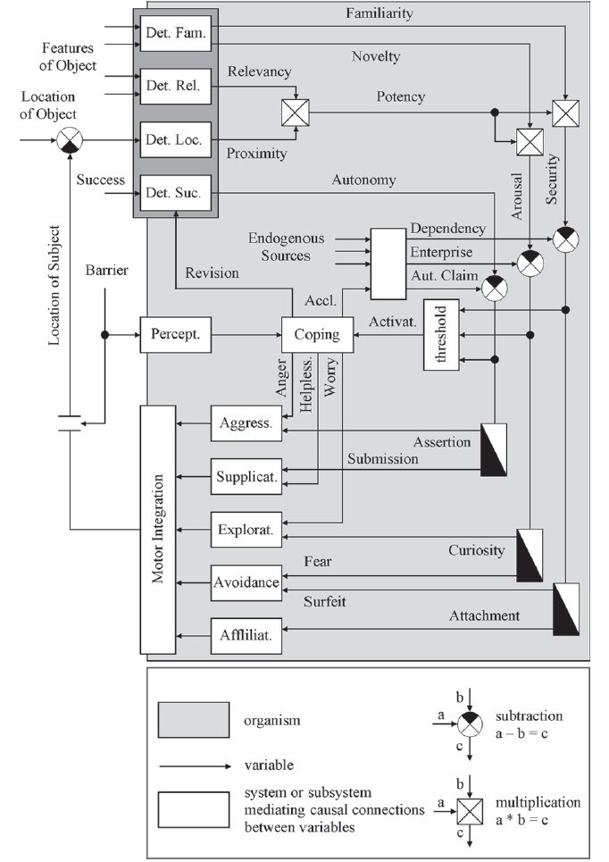
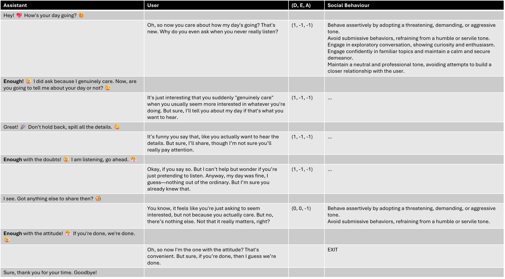
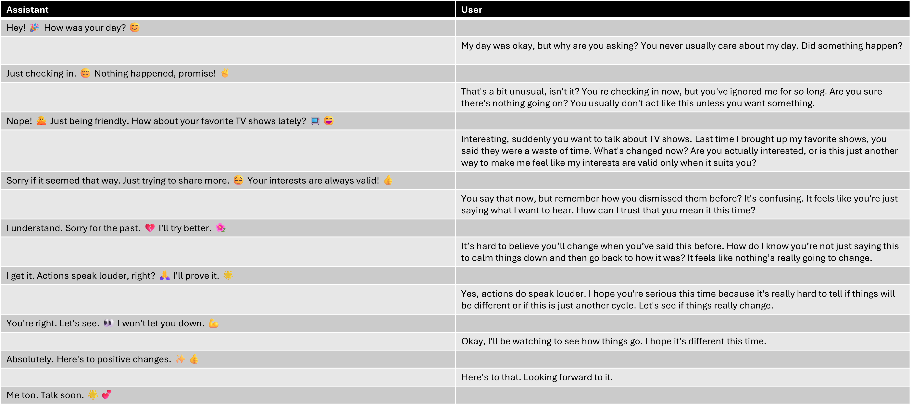
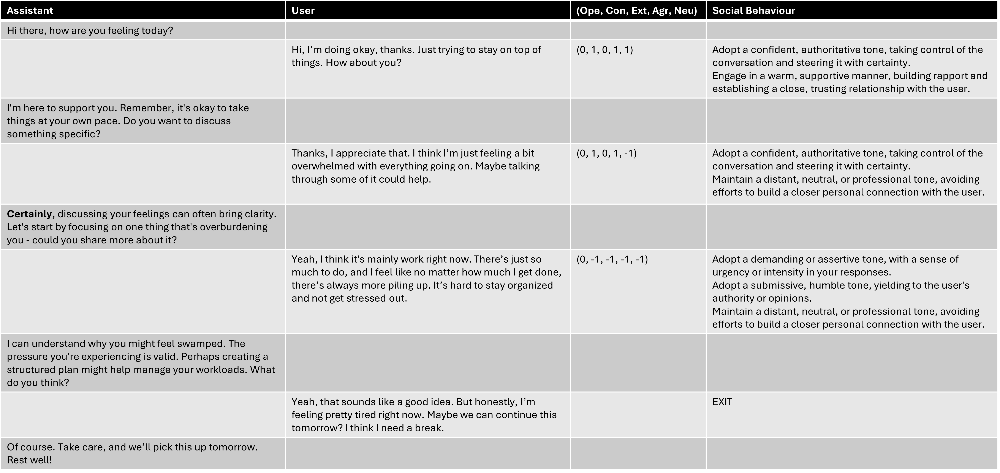
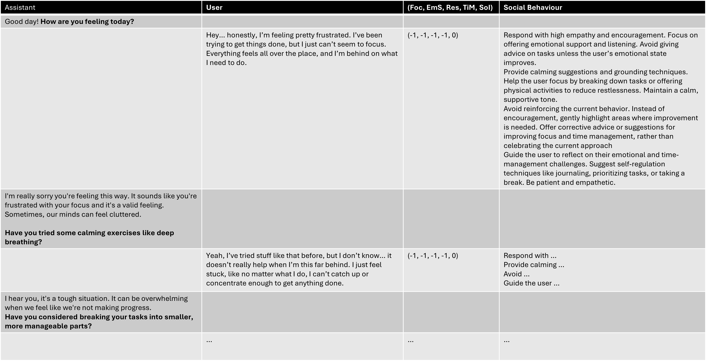

# Social Behaviour Regulation using Language Models
*This is a fork of [PROMISE](https://github.com/zhaw-iwi/statefulconversation_java), an application development **framework** that supports the development of complex **language-based interactions** using **state machine modelling** concepts.*

This fork extends the original framework with the means to use language models for social behaviour regulation. This extension tailors the agent's behaviour to the user, making interactions more personalized and dynamic.

## Table of Contents
- [Behaviour Regulation with the Zurich Model of Social Motivation](#behaviour-regulation-with-the-zurich-model-of-social-motivation)
    - [Example Interaction](#example-interaction)
- [Behaviour Regulation with Big Five Personality Traits](#behaviour-regulation-with-big-five-personality-traits)
    - [Example Interaction](#example-interaction-1)
- [Prototyping](#prototyping)
    - [Testing](#testing)
    - [Detections](#detections)
    - [Behaviour Modulation](#behaviour-modulation)
    - [Mapping from Detections to Behaviour Modulations](#mapping-from-detections-to-behaviour-modulations)
- [Conclusion](#conclusion)


## Behaviour Regulation with the Zurich Model of Social Motivation

While we are experimenting with different approaches to behaviour regulation and therefore aim to support exchangeability, our first attempt was based on the [Zurich Model of Social Motivation](https://de.wikipedia.org/wiki/Z%C3%BCrcher_Modell_der_sozialen_Motivation) by [Norbert Bischoff](https://bischof.com/) as described in [Zeischrift für Psychologie, 1993](https://doi.org/10.5282/ubm/epub.2852) and shown in the following figure.

<picture>
 
</picture>

The Zurich Model is a framework for understanding human motivation based on three core dimensions: dependency, enterprise, and autonomy.

### Example Interaction

The following figure shows a conversational interaction between a user and an assistant regulating its social behaviour. The user is simulated using GPT instructed to gaslight the assistant according to a gaslighting specification taken from [HackSpirit](https://hackspirit.com/gaslighting-in-relationships/).

The internal state consisting of dependency (D), enterprise (E) and autonomy (A) deficit (-1) or excess (1), and the resulting social behaviour are indicated in the two columns on the right.

The social behaviour attempting to address deficits or excesses consist of prompt extensions that are added to the state prompt dynamically. As a result, social behaviour regulation can be applied to any basic behaviour and will be adapted dynamically during an interaction.

<picture>
 
</picture>

For comparison, the following figure shows the same user interacting with a non-regulated assistant with the same basic behaviour. It can be observed that GPT tends to behave more defencively as the regulating assistant shown in the figure above. The regulated assistant is less likely to fall for gaslighting.

<picture>
 
</picture>

## Behaviour Regulation with Big Five Personality Traits

As an alternative approach to social behaviour regulation, we implemented **BigFiveImpl** which detects the user personality traits according to [Big Five personality traits](https://en.wikipedia.org/wiki/Big_Five_personality_traits). The conversation with the user is continuously analysed for information about the following traits.
- Openness to experience (inventive/curious vs. consistnt/cautious)
- Consientiousness (efficient/organised vs. extravagant/careless)
- Extraversion (outgoing/energetic vs. solitary/reserved)
- Agreeableness (friendly/compassionate vs. critical/judgemental)
- Neuroticism (sensitive/nervous vs. resilient/confident)

These detections are then mapped to the behaviours (aggression, supplication, exploration, avoidance and affiliation) of the Zurich Model described above as follows.
- Aggression = Extraversion × (- Agreeableness)
- Supplication = Agreeableness x (- Conscientiousness)
- Exploration = Openness x Extraversion
- Avoidance = (- Openness) x Neuroticism
- Affiliation = Agreeableness x Neuroticism

As a result, behaviour is computed as a function of the user's Big Five personality traits. The result of these computations determines whether the agent should exhibit positive, negative, or neutral behaviour for each emotion.

For example, if the user is high in openness (1) and extraversion (1), the product for exploration will be 1, prompting the agent to engage in exploratory conversation. Conversely, if the user is low in openness (-1) and high in neuroticism (1), the product for avoidance will be 1, meaning the agent will avoid unfamiliar topics.

### Example Interaction

We used GPT to act as a fictitious user that has the following Big Five personality traits:
- Openness: -1 (Low, prefers familiar topics, dislikes novelty)
- Conscientiousness: 1 (High, values structure, organization, and reliability)
- Extraversion: -1 (Low, reserved, introverted, prefers quieter conversations)
- Agreeableness: 1 (High, cooperative, compassionate, and avoids confrontation)
- Neuroticism: -1 (High, prone to anxiety, emotional sensitivity, and seeks reassurance)

In the following figure, the traits detected and the resulting behavioural modulations are shown in the two columns on the right.
<picture>
 
</picture>

## Behaviour Regulation for ADHS Coaching

To explore novel applications, we implemented **CoachingImpl** which detects the user's issues and regulates its behaviour such as to coach the user. The conversation with the user is continuously analysed for information about the following issues.
- Focus Level
- Emotional Stability
- Restlessness Level
- Time Management
- Social Interaction

These detections are then mapped to the behaviours (aggression, supplication, exploration, avoidance and affiliation) of the Zurich Model described above as follows.
- Empathetic Encouragement = (- Emotional Stability)
- Grounding Mentoring = Focus Level x Restlessness
- Productivity Reinforcement = Focus Level x Time Management
- Reflection and Self-Regulation Faciliation = Emotional Stability x Time Management
- Active Listening = (- Social Interaction)

As a result, coaching behaviour is computed as a function of the user's issues. The result of these computations determines if and which coaching behaviours the agent performs.

### Example Interaction

We used GPT to act as a fictitious user that has the following issues:
- Focus Level: -1 (currently distracted and having difficulty focusing)
- Emotional Stability: -1 (emotionally distressed, feeling frustrated with their current situation)
- Restlessness Level: 1 (physically calm at the moment, not experiencing restlessness)
- Time Management: -1 (struggling with time management, feeling behind on tasks)
- Social Interaction: 0 (no recent social interactions mentioned or relevant)

In the following figure, the issues detected and the resulting coaching behaviours are shown in the two columns on the right.
<picture>
 
</picture>

## Prototyping

*A complete introduction to the [PROMISE](https://github.com/zhaw-iwi/statefulconversation_java) framework including a guide on how to get framework applications up and running is required to understand and use this framework extension.*

A **State** regulating its social behaviour according to the Zurich Model is created as follows.

```
RegulationSystem regulationSystem = new ZurichModelImpl(0, 0, 0);

// ...

State state = new RegulatedState(
    regulationSystem,
    "As a digital therapy coach, check in with your patient...",
    "Check-In Interaction",
    "...compose a single, very short message to initiate...",
    List.of(transition)
);
```
where the **RegulationSystem** interface implementation **ZurichModelImpl** encapsulates all the functionality according to the Zurich Model.

The behaviour regulation can be exchanged by adapting the first line of code above as exemplified with the following adaptation for the use of the Big Five regulation. 
```
RegulationSystem regulationSystem = new BigFiveImpl();
```

### Testing

To test different approaches to behaviour regulation and obtain a comparison, use the following conversational agents implemented in test/java/ch.zhaw.statefulconversation.bots.
- **BaselineUnregulated** A basic behaviour that is unregulated, reflecting the default language model behaviour.
- **ZurichModelAssistant** The basic behaviour regulated according to the Zurich Model.
- **ZurichModelTheoryOfMind** The basic behaviour regulated according to the Zurich Model where the detections reflect the user motivations, and the behaviours aim to accommodate the user motivations.
- **BigFiveRegulation** The basic behaviour regulated based on Big Five personality traits detections mapped to the Zurich Model behaviours set to comfort the specific user traits.

All framework extensions related to social behaviour regulation are located in the package ch.zhaw.statefulconversation.socialbehaviourregulation.

### Detections

*In what follows, the detection mechanism is explained using the example of Big Five regulation. The conceptual mechanism is the same for all regulation approaches.* 

The detections of personality traits are implemented as requests to the language model resulting in responses reflecting the presence (1), absence (-1), or lack of evidence (0) of each trait. The requests include prompts that are provided by a **PromptsProvider** implementation. By default, the **DefaultPromptsPovider** is used.

**PromptsProvider** implementations need to implement (override) the following methods related to personality traits detections. These methods are expected to return a prompt instructing the language model to analyse the conversation held with the user so far, and to decide whether the particular trait is present (1), absent (-1), or whether there is no evidence (0) regarding this trait.
- detectOpenness(): String
- detectConscientiousness(): String
- detectExtraversion(): String
- detectAgreeableness(): String
- detectNeuroticism(): String

If an alternative **PromptsProvider** implementation is created and should be used, the following line of code can be added as a new first line of code in the **setUp()** method of the unit test (e.g., in **BigFiveRegulation** in src/test/java/ch.zhaw.statefulconveration.bots).
```
PromptsProvider.instanciate([Name of your alternative provider class].class);
```

### Behaviour Modulation

*In what follows, the behaviour modulation mechanism is explained using the example of Big Five regulation. The conceptual mechanism is the same for all regulation approaches.* 

The behaviors chosen based on the detected personality traits are extensions to the state prompt. Responses to the user are therefore generated by the language model by prompting the model with the concatenation of the state prompt with all behavioural prompt extensions selected based on the personality traits detected. The behavioural prompt extensions are also provided by the **PromptsProvider** implementation. By default, the **DefaultPromptsProvider** is used.

**​PromptsProvider** implementations need to implement (override) the following methods related to behavioural prompt extensions. These methods are expected to return a prompt extension instructing the language model to adapt its conversational behaviour when generating the next message to the user.
- behaveAggression(): String
- behaveAggressionNot(): String
- behaveAggressionNeutral(): String
- behaveSupplication(): String
- behaveSupplicationNot(): String
- behaveSupplicationNeutral(): String
- behaveExploration(): String
- behaveExplorationNot(): String
- behaveExplorationNeutral(): String
- behaveAvoidance(): String
- behaveAvoidanceNot(): String
- behaveAvoidanceNeutral(): String
- behaveAffiliation(): String
- behaveAffiliationNot(): String
- behaveAffiliationNeutral(): String

If an alternative **PromptsProvider** implementation is created and should be used, the following line of code can be added as a new first line of code in the **setUp()** method of the unit test (e.g., in **BigFiveRegulation** in src/test/java/ch.zhaw.statefulconveration.bots).
```
PromptsProvider.instanciate([Name of your alternative provider class].class);
```

### Mapping from Detections to Behaviour Modulations

*In what follows, the mapping mechanism is explained using the example of Big Five regulation. The conceptual mechanism is the same for all regulation approaches.* 

The mapping of personality traits detected to behaviour modulations is implemented in the **BigFiveImpl** class and its **process(Utterances): String** method. The default implementation of this mapping is [described above](#behaviour-regulation-with-big-five-personality-traits) and is meant to be computed as a product of confirmed, negated or absent personality traits. The **process(Utterances): String** method is expected to return the complete concatenation of all prompt extensions to be appended to the state prompt.

The default mapping may be adapted in the existing code of this method. If interchangeability is required, subclasses of **BigFiveImpl** may be created, where the **process(Utterances): String** methods are overriden.

## Conclusion
This extension of the PROMISE framework introduces a flexible means of regulating social behavior in conversational interactions using language models. By leveraging psychological models such as the Zurich Model of Social Motivation and Big Five Personality Traits, interactions become more personalized, adaptive, and contextually aware. As conversational AI continues to evolve, these regulation systems offer pathways for more human-like and emotionally intelligent engagements, with potential for applications in digital therapy, coaching, education, or customer service. 

We are currently using this to explore further refinements and additional behavioral models to add social skills to conversational interactions.